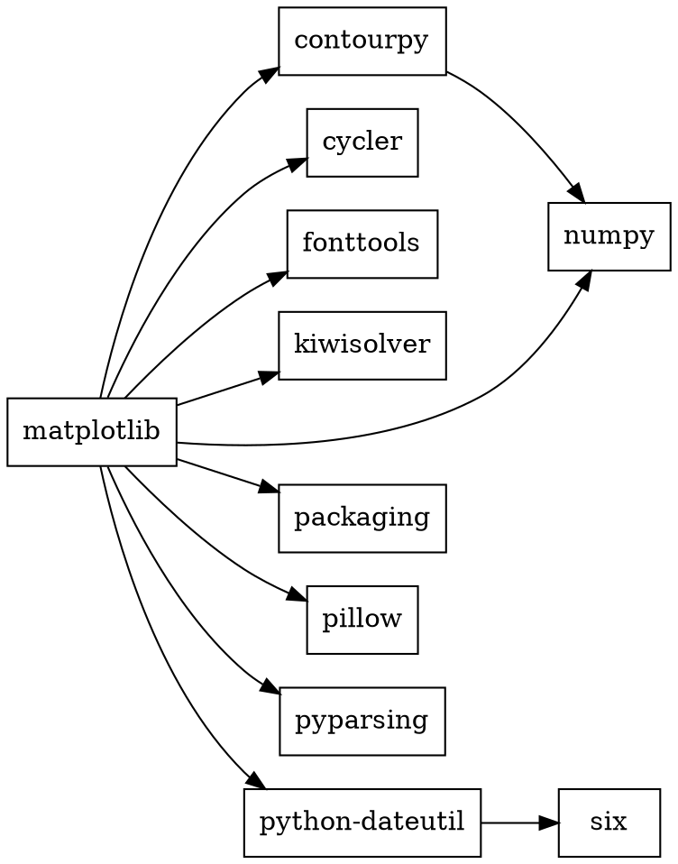
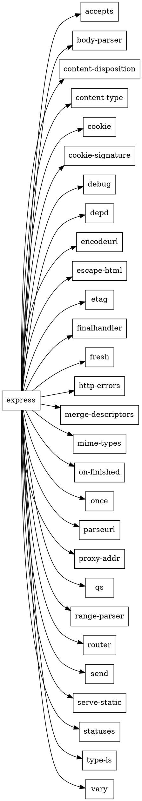
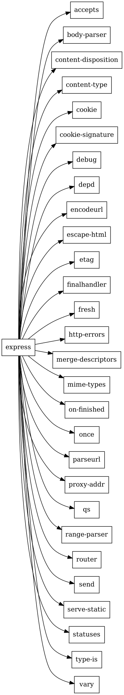

# Практическая работа №2

## Задача 1

```bash
pip show matplotlib
cat $(python3 -c "import matplotlib, os; print(os.path.dirname(matplotlib.__file__))")-*.dist-info/METADATA
```

```
Metadata-Version: 2.1
Name: matplotlib
Version: 3.11.2
Summary: Python plotting package
Author: John D. Hunter, Michael Droettboom
Author-Email: Unknown <matplotlib-users@python.org>
Classifier: Development Status :: 5 - Production/Stable
Classifier: License :: OSI Approved :: Python Software Foundation License
Project-URL: Homepage, https://matplotlib.org
Project-URL: Source Code, https://github.com/matplotlib/matplotlib
Project-URL: Bug Tracker, https://github.com/matplotlib/matplotlib/issues
Requires-Python: >=3.11
Requires-Dist: contourpy>=1.0.1
Requires-Dist: cycler>=0.10
Requires-Dist: fonttools>=4.28.2
Requires-Dist: kiwisolver>=1.3.1
Requires-Dist: numpy>=1.25
Requires-Dist: packaging>=20.0
Requires-Dist: pillow>=9
Requires-Dist: pyparsing>=3
Requires-Dist: python-dateutil>=2.7
```

Основные элементы: `Name` — имя пакета, `Version` — версия, `Summary` — краткое описание, `Author` — авторы, `Classifier` — классификаторы PyPI (статус, лицензия), `Project-URL` — ссылки на сайт, исходный код и трекер ошибок, `Requires-Python` — требуемая версия Python, `Requires-Dist` — зависимости с ограничениями на версии.

Получение пакета без менеджера пакетов:

```bash
git clone https://github.com/matplotlib/matplotlib.git
cd matplotlib
python3 -m build
```

## Задача 2

```bash
npm view express
cat node_modules/express/package.json
```

```json
{
  "name": "express",
  "description": "Fast, unopinionated, minimalist web framework",
  "version": "5.2.1",
  "author": "TJ Holowaychuk <tj@vision-media.ca>",
  "license": "MIT",
  "repository": "expressjs/express",
  "homepage": "https://expressjs.com/",
  "keywords": ["express", "framework", "sinatra", "web", "http", "rest", "restful", "router", "app", "api"],
  "dependencies": {
    "accepts": "^2.0.0",
    "body-parser": "^2.2.1",
    "content-disposition": "^1.0.0",
    "content-type": "^1.0.5",
    "cookie": "^0.7.1",
    "cookie-signature": "^1.2.1",
    "debug": "^4.4.0",
    "depd": "^2.0.0",
    "encodeurl": "^2.0.0",
    "escape-html": "^1.0.3",
    "etag": "^1.8.1",
    "finalhandler": "^2.1.0",
    "fresh": "^2.0.0",
    "http-errors": "^2.0.0",
    "merge-descriptors": "^2.0.0",
    "mime-types": "^3.0.0",
    "on-finished": "^2.4.1",
    "once": "^1.4.0",
    "parseurl": "^1.3.3",
    "proxy-addr": "^2.0.7",
    "qs": "^6.14.0",
    "range-parser": "^1.2.1",
    "router": "^2.2.0",
    "send": "^1.1.0",
    "serve-static": "^2.2.0",
    "statuses": "^2.0.1",
    "type-is": "^2.0.1",
    "vary": "^1.1.2"
  },
  "devDependencies": { "mocha": "^10.7.3", "eslint": "8.47.0", "...": "..." },
  "engines": { "node": ">= 18" },
  "files": ["LICENSE", "Readme.md", "index.js", "lib/"],
  "scripts": { "lint": "eslint .", "test": "mocha --require test/support/env --reporter spec --check-leaks test/ test/acceptance/" }
}
```

Основные элементы: `name` — имя пакета, `version` — версия, `description` — описание, `author` — автор, `license` — лицензия, `repository` — репозиторий с исходным кодом, `homepage` — сайт, `keywords` — ключевые слова для поиска, `dependencies` — зависимости (в формате semver), `devDependencies` — зависимости для разработки и тестов, `engines` — требуемая версия Node.js, `files` — файлы, попадающие в пакет, `scripts` — команды, запускаемые через `npm run`.

Получение пакета без менеджера пакетов:

```bash
git clone https://github.com/expressjs/express.git
```

```bash
curl -O https://registry.npmjs.org/express/-/express-5.2.1.tgz
tar -xzf express-5.2.1.tgz
```

## Задача 3



```bash
dot -Tpng images/matplotlib.dot -o images/matplotlib.png
```




```bash
dot -Tpng images/express.dot -o images/express.png
```



## Задача 4

```minizinc
include "all_different.mzn";

array[1..6] of var 0..9: d;

constraint d[1] + d[2] + d[3] = d[4] + d[5] + d[6];
constraint all_different(d);

var int: s = d[1] + d[2] + d[3];

solve minimize s;

output ["Билет: ", join("", [show(d[i]) | i in 1..6]), "\n",
        "Сумма трёх цифр: ", show(s), "\n"];
```

```
Билет: 413206
Сумма трёх цифр: 8
```

## Задача 5

```minizinc
% 0 - пакет не установлен, иначе номер версии в массиве
array[1..6] of string: menu_v = ["1.0.0", "1.1.0", "1.2.0", "1.3.0", "1.4.0", "1.5.0"];
array[1..5] of string: dropdown_v = ["1.8.0", "2.0.0", "2.1.0", "2.2.0", "2.3.0"];
array[1..2] of string: icons_v = ["1.0.0", "2.0.0"];

var 0..6: menu;
var 0..5: dropdown;
var 0..2: icons;

% root зависит от menu >=1.0.0 и icons ^1.0.0
constraint menu >= 1;
constraint icons = 1;

% menu 1.1.0 - 1.5.0 зависят от dropdown >=2.0.0
constraint menu >= 2 -> dropdown >= 2;

% menu 1.0.0 зависит от dropdown ^1.8.0
constraint menu = 1 -> dropdown = 1;

% dropdown 2.0.0 - 2.3.0 зависят от icons ^2.0.0
constraint dropdown >= 2 -> icons = 2;

solve satisfy;

output ["menu ", menu_v[fix(menu)], "\n",
        "dropdown ", dropdown_v[fix(dropdown)], "\n",
        "icons ", icons_v[fix(icons)], "\n"];
```

```
menu 1.0.0
dropdown 1.8.0
icons 1.0.0
```

## Задача 6

```minizinc
% 0 - пакет не установлен, иначе номер версии в массиве
array[1..2] of string: foo_v = ["1.0.0", "1.1.0"];
array[1..1] of string: left_v = ["1.0.0"];
array[1..1] of string: right_v = ["1.0.0"];
array[1..2] of string: shared_v = ["1.0.0", "2.0.0"];
array[1..2] of string: target_v = ["1.0.0", "2.0.0"];

var 0..2: foo;
var 0..1: left;
var 0..1: right;
var 0..2: shared;
var 0..2: target;

% root 1.0.0 зависит от foo ^1.0.0 и target ^2.0.0
constraint foo >= 1;
constraint target = 2;

% foo 1.1.0 зависит от left ^1.0.0 и right ^1.0.0
constraint foo = 2 -> (left = 1 /\ right = 1);

% left 1.0.0 зависит от shared >=1.0.0
constraint left = 1 -> shared >= 1;

% right 1.0.0 зависит от shared <2.0.0
constraint right = 1 -> shared = 1;

% shared 1.0.0 зависит от target ^1.0.0
constraint shared = 1 -> target = 1;

% пакет ставится, только если от него зависит другой установленный пакет
constraint left >= 1 -> foo = 2;
constraint right >= 1 -> foo = 2;
constraint shared >= 1 -> (left >= 1 \/ right >= 1);

solve satisfy;

function string: ver(array[int] of string: v, var int: i) =
    if fix(i) = 0 then "не установлен" else v[fix(i)] endif;

output ["foo ", ver(foo_v, foo), "\n",
        "left ", ver(left_v, left), "\n",
        "right ", ver(right_v, right), "\n",
        "shared ", ver(shared_v, shared), "\n",
        "target ", ver(target_v, target), "\n"];
```

```
foo 1.0.0
left не установлен
right не установлен
shared не установлен
target 2.0.0
```

## Задача 7

```python
import subprocess


def parse(v):
    return tuple(int(x) for x in v.split("."))


def match(version, constraint):
    v = parse(version)
    for cond in constraint.split():
        if cond.startswith("^"):
            base = parse(cond[1:])
            ok = v >= base and v[0] == base[0]
        elif cond.startswith(">="):
            ok = v >= parse(cond[2:])
        elif cond.startswith("<="):
            ok = v <= parse(cond[2:])
        elif cond.startswith(">"):
            ok = v > parse(cond[1:])
        elif cond.startswith("<"):
            ok = v < parse(cond[1:])
        else:
            ok = v == parse(cond.lstrip("="))
        if not ok:
            return False
    return True


def build_model(packages, root):
    versions = {p: sorted(packages[p], key=parse) for p in packages}
    lines = []
    for p, vs in versions.items():
        lines.append(f"var 0..{len(vs)}: {p};")
    lines.append(f"constraint {root} >= 1;")
    parents = {p: [] for p in packages}
    for p, vs in versions.items():
        for i, v in enumerate(vs, 1):
            for dep, cons in packages[p][v].items():
                ok = [j for j, dv in enumerate(versions[dep], 1) if match(dv, cons)]
                if ok:
                    allowed = "{" + ", ".join(map(str, ok)) + "}"
                    lines.append(f"constraint {p} = {i} -> {dep} in {allowed};")
                else:
                    lines.append(f"constraint {p} != {i};")
                parents[dep].append(f"{p} = {i}")
    for p, conds in parents.items():
        if p != root:
            why = " \\/ ".join(conds) if conds else "false"
            lines.append(f"constraint {p} >= 1 -> ({why});")
    lines.append(f"solve maximize {' + '.join(versions)};")
    lines.append("output [" + ", ".join(
        f'"{p}=", show({p}), "\\n"' for p in versions) + "];")
    return "\n".join(lines) + "\n", versions


def solve(packages, root="root"):
    model, versions = build_model(packages, root)
    print(model)
    with open("deps.mzn", "w") as f:
        f.write(model)
    out = subprocess.run(["minizinc", "--solver", "chuffed", "deps.mzn"],
                         capture_output=True, text=True).stdout
    if "=====UNSATISFIABLE=====" in out:
        print("Решения нет")
        return
    result = {}
    for line in out.split("----------")[-2].split():
        p, i = line.split("=")
        result[p] = int(i)
    for p, i in result.items():
        print(p, versions[p][i - 1] if i else "не установлен")


packages = {
    "root": {"1.0.0": {"foo": "^1.0.0", "target": "^2.0.0"}},
    "foo": {
        "1.1.0": {"left": "^1.0.0", "right": "^1.0.0"},
        "1.0.0": {},
    },
    "left": {"1.0.0": {"shared": ">=1.0.0"}},
    "right": {"1.0.0": {"shared": "<2.0.0"}},
    "shared": {
        "2.0.0": {},
        "1.0.0": {"target": "^1.0.0"},
    },
    "target": {"2.0.0": {}, "1.0.0": {}},
}

solve(packages)
```

```
root 1.0.0
foo 1.0.0
left не установлен
right не установлен
shared не установлен
target 2.0.0
```
